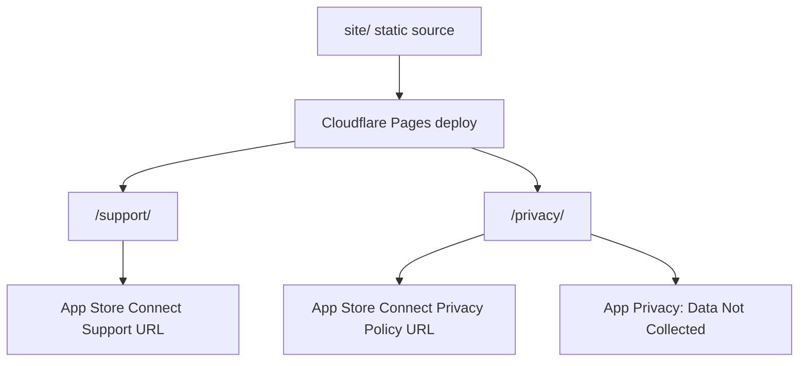

# feat: Create Plume Support and Privacy Page URLs

## Goal Capsule

Create two public, App Store-ready URLs for Plume:

- `https://plume.turfterrace.com/support/`
- `https://plume.turfterrace.com/privacy/`

The pages should be static, HTTPS-only, publicly reachable without authentication, and narrow enough to satisfy App Store Connect without widening Plume's privacy or medical-claims surface.

**Authority hierarchy:** Apple App Store Connect requirements first; current Plume privacy/runtime facts second; launch speed third; visual polish fourth.

**Stop condition:** Do not enter these URLs in App Store Connect until both routes return `200`, display contact information, match the app's no-data posture, and avoid medical or treatment claims.

---

## Items to review

- [ ] Use `plume.turfterrace.com/support/` and `plume.turfterrace.com/privacy/` as the App Store URLs.
- [ ] Use a Cloudflare Pages static deploy from this repo's `site/` directory.
- [ ] Use `support@turfterrace.com` as the public support email.
- [ ] Include public legal address and telephone details on the support page only if required for the relevant storefronts or by Turf Terrace policy.
- [ ] Keep both pages compliance-first: no analytics, no marketing pixels, no newsletter form, no medical/wellness expansion.

---

## Product Contract

### Summary

Plume needs public support and privacy URLs before App Store submission. The app itself already has the right privacy posture: no accounts, no analytics, no third-party SDKs, no network calls, and only local settings stored through `@AppStorage`/`UserDefaults`.

The pages should close the App Store Connect paperwork gap without turning a precise breathing instrument into a broader wellness site.

### Problem Frame

Apple requires a Privacy Policy URL and a Support URL during App Store setup. The current repository is private, has no Pages configuration, and contains review/demo HTML under `docs/`, not a launch site. Hosting from the private app repo's existing docs surface would either expose the wrong material or require a hosting path that does not exist.

The practical path is a tiny static site that ships only the two compliance pages and can be bound to a public custom domain.

### Requirements

- R1. Provide a public support URL that includes actual contact information for app issues, feedback, and feature requests.
- R2. Provide a public privacy URL that states Plume collects and transmits no app data.
- R3. Keep the privacy policy aligned with `BreatheClock/Resources/PrivacyInfo.xcprivacy`: no tracking, no tracking domains, no collected data types, and only the declared UserDefaults required-reason API.
- R4. Keep all copy consistent with the in-app safety position in `BreatheClock/Models/BreathingModels.swift`: general wellbeing, not medical advice.
- R5. Serve the pages without authentication, JavaScript dependency, cookies, analytics, or third-party embeds.
- R6. Record the final URLs in `docs/app-store-submission-review.md` so launch status stays visible in the repo.

### Scope Boundaries

In scope:

- A static support page.
- A static privacy policy page.
- Minimal shared page styling.
- Deployment configuration for a public HTTPS host.
- Documentation of the final URLs and App Store Connect handoff.

Deferred to follow-up work:

- A full marketing site.
- Press kit, screenshots, ASO copy, or launch video.
- Newsletter signup, analytics, crash reporting, or product telemetry.
- In-app links to support/privacy pages.

Outside this product's identity:

- Medical, diagnostic, therapeutic, or treatment claims.
- Copy that frames Plume as a health intervention rather than a breathing timer for general wellbeing.

### Assumptions

- `plume.turfterrace.com` can be configured in DNS.
- `support@turfterrace.com` exists or can be created before launch.
- Turf Terrace Ltd remains the public developer identity for the pages.
- Cloudflare Pages is acceptable as the host because the pages need a public HTTPS URL and no backend.

---

## Planning Contract

### Key Technical Decisions

- KTD1. Use a static micro-site under `site/`. The repo already uses `docs/` for internal launch reviews and design artifacts, so `site/` keeps public pages separate from review material.
- KTD2. Deploy through Cloudflare Pages with a custom domain. The GitHub repository is private and has no Pages configuration, while App Store URLs must be publicly reachable. A public static deploy avoids exposing the app repo.
- KTD3. Avoid analytics and client-side scripts. The privacy page should not create a new data surface that conflicts with Plume's App Store privacy answer.
- KTD4. Make the privacy policy app-scoped. The page should describe Plume's app behavior: no accounts, no network transmission, no health data access, no tracking, and no third-party SDK collection. Support email handling belongs in a short "Contacting support" paragraph.
- KTD5. Keep support copy operational, not promotional. The support page should give users a clear email path and enough troubleshooting context without adding broad wellness claims.

### High-Level Technical Design



### Deployment Shape

Expected source layout:

```text
site/
  _headers
  index.html
  privacy/
    index.html
  support/
    index.html
  assets/
    plume.css
  README.md
```

`site/index.html` should redirect or link to the two compliance pages. It should not become a marketing homepage in this unit of work.

---

## Implementation Units

### U1. Confirm launch constants and create the static site skeleton

- **Goal:** Create a clean public-site directory with the canonical routes and no dependency on the Swift app build.
- **Requirements:** R1, R2, R5
- **Dependencies:** None
- **Files:** `site/index.html`, `site/privacy/index.html`, `site/support/index.html`, `site/assets/plume.css`, `site/README.md`
- **Approach:** Build plain HTML and CSS. Use document titles that match App Store expectations: "Plume Support" and "Plume Privacy Policy". Add a small root page that points to both routes.
- **Patterns to follow:** Keep the restrained Plume tone from `docs/app-store-submission-review.md` and the safety language from `BreatheClock/Models/BreathingModels.swift`.
- **Test scenarios:**
  - Load `/support/` locally and confirm it renders without JavaScript.
  - Load `/privacy/` locally and confirm it renders without JavaScript.
  - Disable external network access in the browser and confirm the pages still render all critical content.
- **Verification:** The `site/` tree exists, routes are stable, and pages do not depend on build tooling.

### U2. Write the privacy policy page

- **Goal:** Publish a short privacy policy that matches Plume's actual app behavior and App Store privacy answers.
- **Requirements:** R2, R3, R4, R5
- **Dependencies:** U1
- **Files:** `site/privacy/index.html`, `site/assets/plume.css`
- **Approach:** State that Plume does not collect, transmit, sell, or share personal data; does not use analytics or tracking; does not create accounts; does not access HealthKit, location, camera, microphone, contacts, photos, or notifications; and stores preferences locally on the device. Add a support-contact paragraph explaining that if a user emails support, the email address and message are handled only to respond to the request.
- **Patterns to follow:** Mirror `BreatheClock/Resources/PrivacyInfo.xcprivacy` and the "Privacy surface" finding in `docs/app-store-submission-review.md`.
- **Test scenarios:**
  - Compare every data statement against `PrivacyInfo.xcprivacy` and confirm there is no mismatch.
  - Search the page for tracking, analytics, account, and health-data claims and confirm each says "not used" or equivalent.
  - Confirm the page has a last-updated date and support contact.
- **Verification:** The policy supports an App Store Connect "Data Not Collected" answer without adding caveats that require nutrition-label changes.

### U3. Write the support page

- **Goal:** Publish a support page that satisfies Apple's contact-information expectation and gives users a direct route for help.
- **Requirements:** R1, R4, R5
- **Dependencies:** U1
- **Files:** `site/support/index.html`, `site/assets/plume.css`
- **Approach:** Include the support email, app name, developer identity, what to include in a bug report, and a short safety note that matches the in-app disclaimer. Add legal address and phone only if James confirms they should be public or local law requires them for the storefronts in scope.
- **Patterns to follow:** Use the existing wording: "general wellbeing, not medical advice" and "stop if you feel faint, breathless, or distressed."
- **Test scenarios:**
  - Confirm the support page contains an email address visible as text, not only a `mailto:` link.
  - Confirm the support page gives users a clear path for app issues, feedback, and feature requests.
  - Confirm the page does not imply emergency, medical, diagnosis, therapy, or treatment support.
- **Verification:** The support page gives real contact information and stays inside Plume's safety framing.

### U4. Add public-hosting configuration

- **Goal:** Make the static site deployable to a public HTTPS host with stable `/support/` and `/privacy/` routes.
- **Requirements:** R1, R2, R5
- **Dependencies:** U1, U2, U3
- **Files:** `site/_headers`, `site/README.md`
- **Approach:** Configure Cloudflare Pages to serve `site/` as the project root. Add basic security headers for static pages: no frame embedding, no MIME sniffing, strict referrer policy, and a restrictive content security policy that allows only same-origin assets.
- **Execution note:** This is mostly hosting/configuration work; prefer public URL smoke verification over unit coverage.
- **Test scenarios:**
  - Visit both final URLs in a private browser window and confirm they load without authentication.
  - Confirm both routes return HTTPS and do not redirect to a private GitHub URL.
  - Confirm the pages load without third-party requests in browser dev tools.
- **Verification:** Both public URLs return `200` and serve the expected content over HTTPS.

### U5. Update launch documentation and App Store Connect fields

- **Goal:** Close the launch paperwork loop by recording the final URLs and entering them in App Store Connect.
- **Requirements:** R1, R2, R3, R6
- **Dependencies:** U4
- **Files:** `docs/app-store-submission-review.md`
- **Approach:** Add the final Support URL and Privacy Policy URL to the launch review, mark the existing privacy-policy hosting item complete, and enter the URLs in App Store Connect. In App Privacy, keep the answer as "Data Not Collected" because the app sends no data from the device.
- **Execution note:** App Store Connect acceptance is the real proof here; source changes alone do not close the gate.
- **Test scenarios:**
  - Paste the Support URL into App Store Connect and confirm the field accepts it.
  - Paste the Privacy Policy URL into App Store Connect and confirm the field accepts it.
  - Re-check App Privacy answers against the final policy page before submitting.
- **Verification:** App Store Connect stores both URLs, the launch review names them, and no app binary rebuild is needed for this change.

---

## Verification Contract

| Gate | Applies to | Done signal |
|---|---|---|
| Static render check | U1-U3 | `/support/` and `/privacy/` render locally with CSS and readable copy. |
| Privacy consistency check | U2, U5 | The privacy page matches `PrivacyInfo.xcprivacy` and supports "Data Not Collected". |
| Contact-information check | U3 | The support page contains visible contact details and a clear support purpose. |
| Public URL smoke check | U4 | Both final HTTPS URLs return `200` without authentication. |
| App Store Connect handoff | U5 | Support URL and Privacy Policy URL fields are saved in App Store Connect. |

---

## Risks & Dependencies

- **DNS and hosting access:** The plan assumes access to configure `plume.turfterrace.com`. If that is not available, use a public Cloudflare Pages subdomain temporarily, then swap to the custom domain before launch.
- **Public contact details:** Apple says support URLs must lead to actual contact information as required by local law. Email is the minimum practical route; legal address or phone may be needed depending on storefront and policy choices.
- **Privacy drift:** Adding analytics, forms, or third-party scripts to these pages would undermine the simple "Data Not Collected" launch posture. Keep these pages static.
- **Medical-device framing:** Health & Fitness apps face extra scrutiny around medical-device and treatment claims. These pages should repeat the app's "general wellbeing, not medical advice" boundary and avoid new claims.

---

## Definition of Done

- `site/support/index.html` and `site/privacy/index.html` exist and render as static public pages.
- The final public URLs are `https://plume.turfterrace.com/support/` and `https://plume.turfterrace.com/privacy/`, unless review selects a different domain.
- The support page includes real contact information for Plume support.
- The privacy page states that Plume collects no app data and matches `PrivacyInfo.xcprivacy`.
- The pages do not load analytics, marketing pixels, external scripts, cookies, or third-party embeds.
- The final URLs are saved in App Store Connect.
- `docs/app-store-submission-review.md` records the URLs and marks the privacy/support URL blocker complete.

---

## Sources & Research

- Apple App Store Connect Reference, App information: Privacy Policy URL is required for iOS apps.
  <https://developer.apple.com/help/app-store-connect/reference/app-information/app-information/>
- Apple App Store Connect Reference, Platform version information: Support URL is required and must lead to contact information.
  <https://developer.apple.com/help/app-store-connect/reference/app-information/platform-version-information/>
- Apple App Store Connect Reference, App privacy: Privacy Policy URL is required for all apps.
  <https://developer.apple.com/help/app-store-connect/reference/app-information/app-privacy/>
- `docs/app-store-submission-review.md`: Plume's current launch blocker list and privacy posture.
- `BreatheClock/Resources/PrivacyInfo.xcprivacy`: declared no tracking, no tracking domains, no collected data, UserDefaults required-reason access.
- `BreatheClock/Models/BreathingModels.swift`: in-app safety disclaimer and contraindications.
